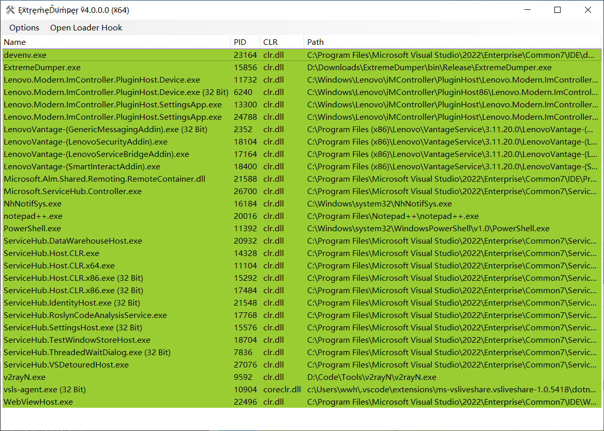
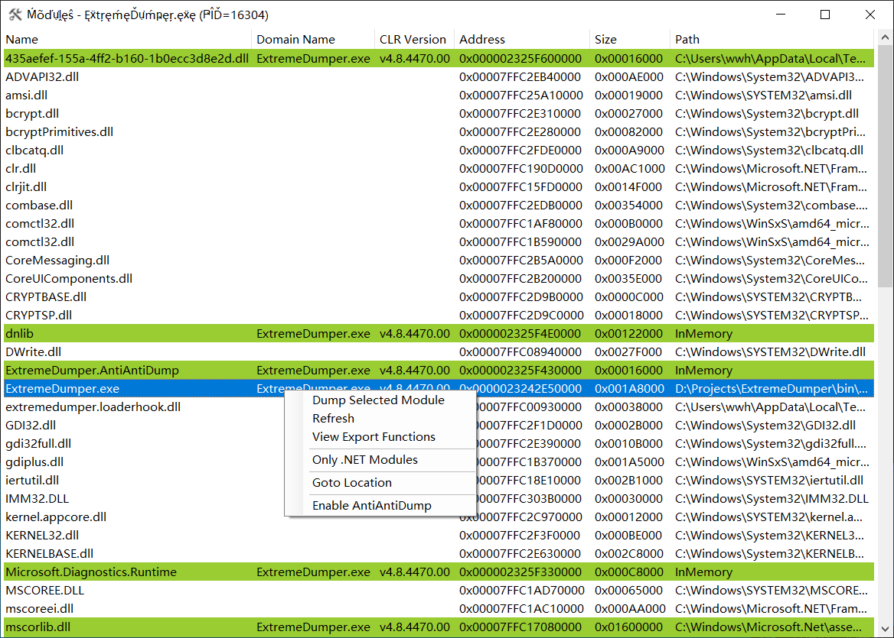
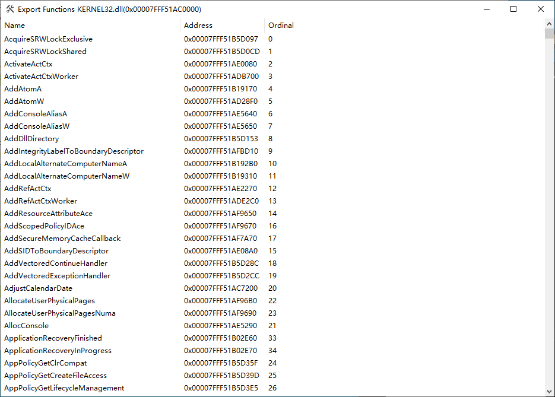
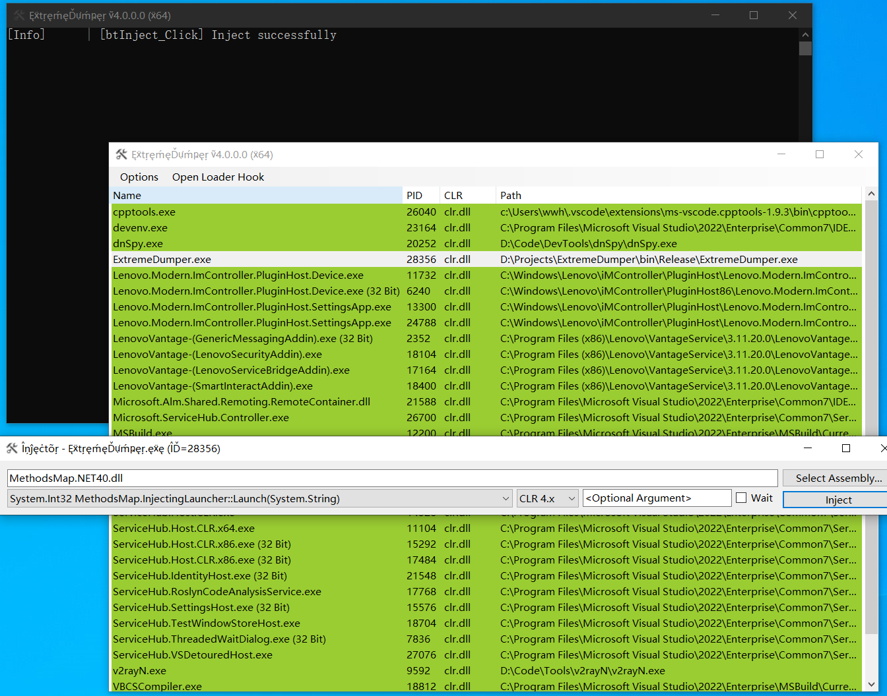
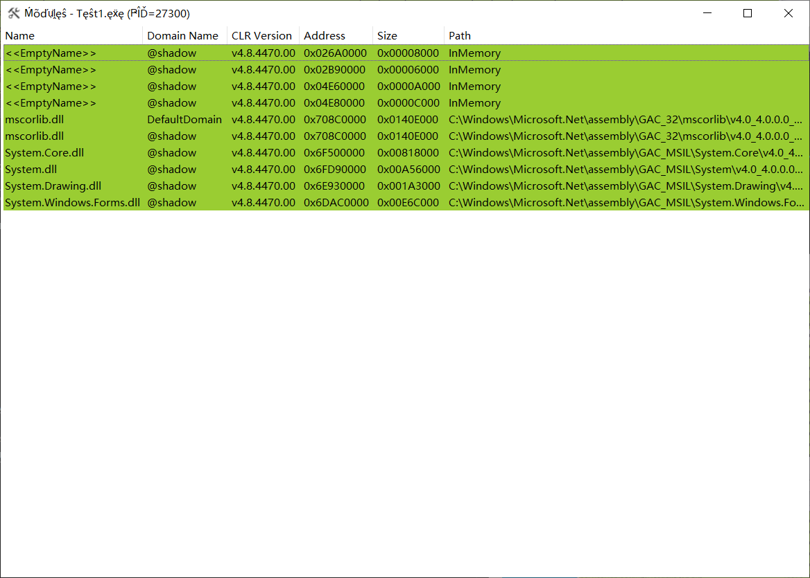
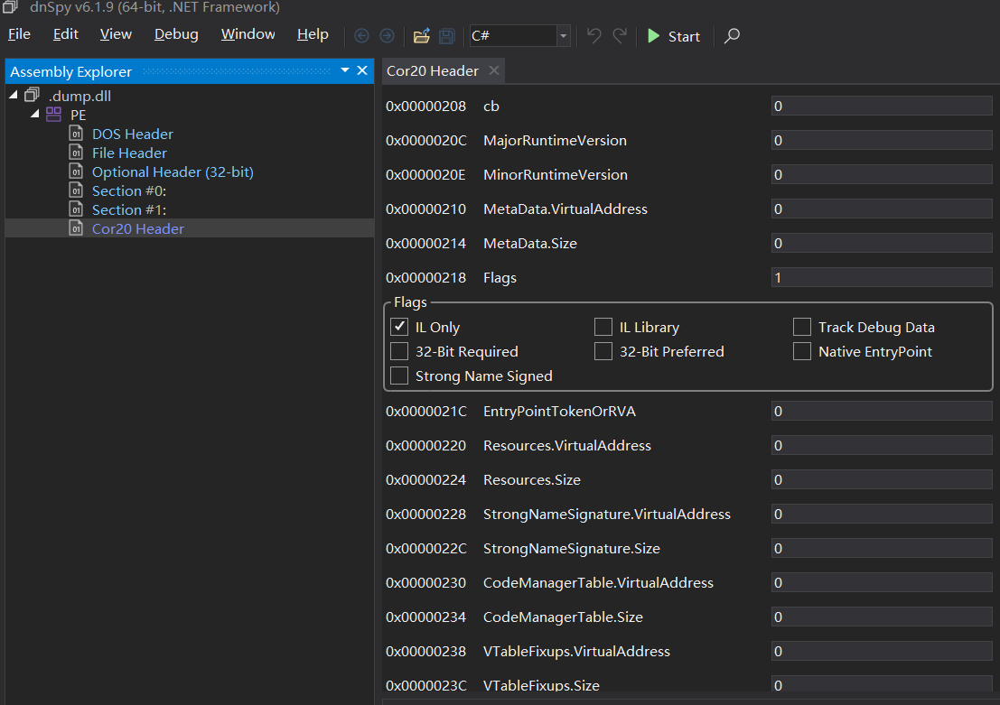
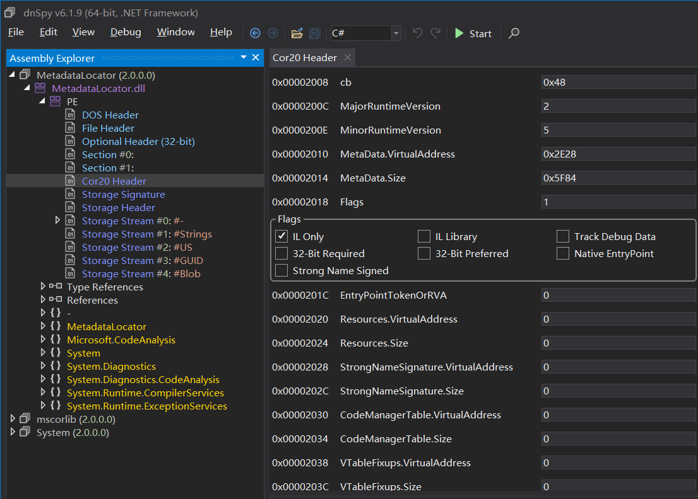
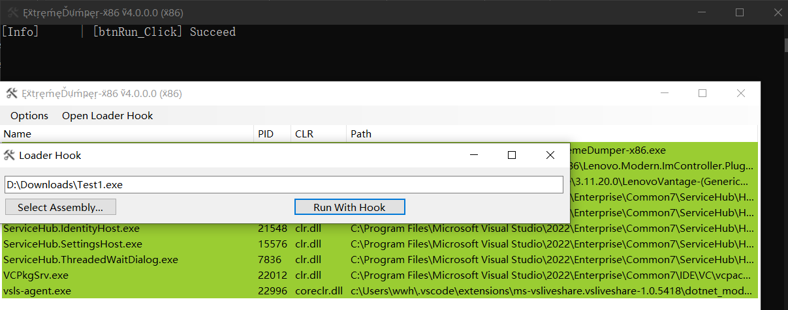
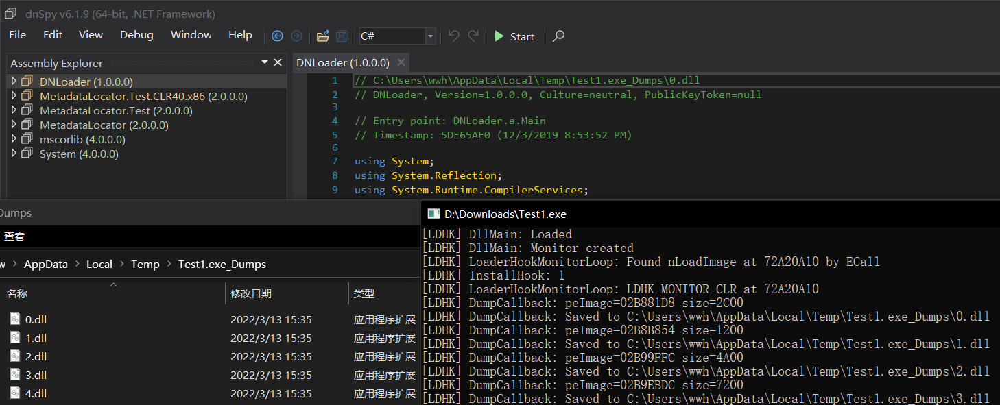

# ExtremeDumper 
.NET Assembly Dumper

[中文README](./README.zh-CN.md)

## Features
* List all processes and highlight .NET processes
* List all modules in a process and highlight .NET modules
* Walk memory pages and dump all valid .NET assemblies
* Dump specified module in modules view
* Inject .NET assembly into any process
* Enhanced anti-dump bypass mode
* .NET assembly loader hook
* Anti title keyword detection
* Portable and only one executable file

## Description
### View Processes

The default page is process view. You can right click here to dump all .NET modules and view modules in selected process. And also you can click "Inject Dll" to inject a .NET assembly into any process. Any process which contains desktop clr or coreclr will be marked as green.

### View Modules

This page show all modules in select process and you can just view .NET modules by click "Only .NET Modules". Any .NET module will be marked as green.

### View Exported Functions

This page show exported functions for given module.

### Inject .NET Assemblies

Currently the injector supports any .NET Framework assembly with any platform target. And you can pass a string argument to injection main method in injector. In the future it will supports .NET Core.

### Bypass Anti-Dump
Before:

After:

#### Usage
Open context menu in modules view and click 'Enable AntiAntiDump'. After enabling it, you can directly and easily dump all .NET assembly which contains anti-dump protection.

#### Principle
ExtremeDumper will inject core dll into target process and read metadata info from clr internal object. Unlike AntiAntiDump in V2, this one has almost perfect compatibility.

### .NET Assembly Loader Hook

#### Usage
Click 'Open Loader Hook' in main window and you will see 'Loader Hook' window. Select a program to dump and click 'Run With Hook'. 

#### Advanced Usage
Rename 'ExtremeDumper.LoaderHook.dll' to 'version.dll' and put it in the root of the program. It can be loaded in dll hijack mode.

#### Principle
Loader hook will hook 'clr!AssemblyNative::LoadImage' at startup of the application. When any .NET assembly is loaded by apis like 'Assembly.Load(byte[])', loader hook will save raw byte array to disk.

## Downloads
GitHub: [Latest release](https://github.com/wwh1004/ExtremeDumper/releases/latest/download/ExtremeDumper.zip)

AppVeyor: [Latest build](https://ci.appveyor.com/api/buildjobs/ytfttpe2ev8kyheu/artifacts/bin%2FRelease%2FExtremeDumper.zip)
